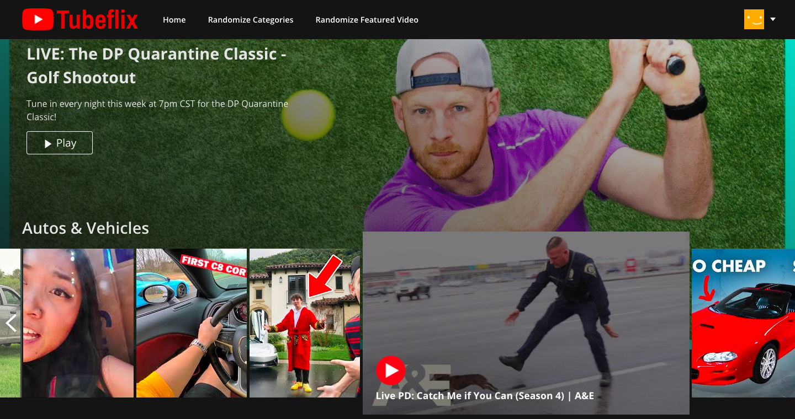

  

<h1 align="center">
   | Tubeflix
</h1>

<h3 align="center" style="font-weight: bold">
  <a href="https://tube-flix.web.app/" style="text-decoration: none">Live Site</a>
</h3>

  

\
This is a React demo that imports YouTube content from the official API into a Netflix-style web app.

## Technologies

### Core

  * [JavaScript/React](https://reactjs.org/)

### API

  * [YouTube Data API](https://developers.google.com/youtube/v3)
  * [Axios](https://github.com/axios/axios)

### Backend / Database

  * [Firebase](https://firebase.google.com/)

### User Interface

  * [CSS Modules](https://github.com/css-modules/css-modules)

## Questions?

Feel free to contact Mike at mldunham@gmail.com or visit https://www.mikedunham.org.